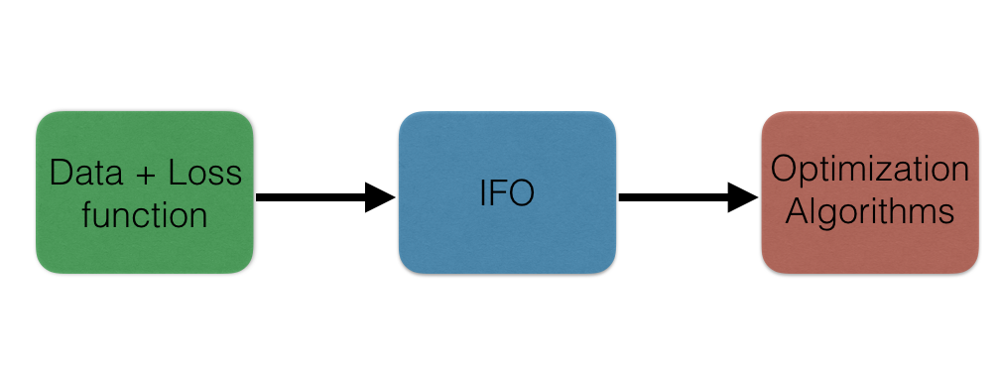
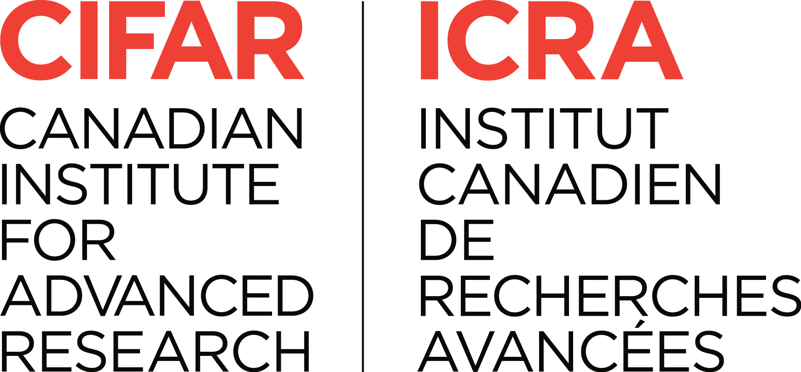

.. casimir documentation master file, created by
   sphinx-quickstart on Fri Oct 12 19:57:16 2018.
   You can adapt this file completely to your liking, but it should at least
   contain the root `toctree` directive.

Casimir: Catalyst, smoothing, and inference
===========================================

A toolbox of selected optimization algorithms including Casimir-SVRG
(as well as SVRG and Catalyst-SVRG as special cases)
for unstructured tasks such as binary classification, and structured prediction tasks
such as visual object localization and named entity recognition.
This is code accompanying the paper
"`A Smoother Way to Train Structured Prediction Models
<https://krishnap25.github.io/papers/2018_neurips_smoother.pdf>`_" in NeurIPS 2018.
The package is licensed under the GPLv3 license.

Overview
--------
This package considers minimizing convex functions of the form

.. math::

    f(w) = \frac{1}{n} \sum_{i=1}^n f_i(w) + r(w),

where each :math:`f_i: R^d \to R` is convex and :math:`r: R^d \to R`
is a strongly convex regularizing function.

All primal incremental optimization algorithms require defining an
*incremental first order oracle* (IFO) for :math:`f`.
That is, given an integer :math:`i` and a :math:`w \in R^d`, the IFO returns
the function value :math:`f_i(w)` and 
the gradient :math:`\nabla f_i(w)` if it exists or a subgradient
:math:`g \in \partial f_i(w)` otherwise.

This package also considers non-smooth functions of the form :math:`h(Aw)`
where :math:`h` is smoothable,
i.e., a smooth approximation :math:`h_\mu` can be computed analytically or algorithmically.
Examples include the structural hinge loss for structured prediction.
In this case, the code must define a *smoothed incremental first order oracle*,
which returns :math:`f_{i, \mu}(w)` and :math:`\nabla f_{i, \mu}(w)`.

This package provides primal incremental optimization algorithms to minimize :math:`f(w)`
defined above. The implemented algorithms include Casimir-SVRG, SVRG and SGD.
To use these optimization algorithms on new data and loss functions, the user simply has to define
a (smoothed) IFO for this problem. The framework of IFOs decouples the optimization from the data handling and
loss function definition. This idea is captured by the figure below.

..
   See IFOs for logistic regression (`casimir/data/classification.py`) or
   for structural support vector machines for named entity recognition
   (`casimir/data/named_entity_recognition/`)
   and visual object localization (`casimir/data/localization/`).

Table of Contents
-----------------
.. toctree::
   :maxdepth: 2

   Getting Started <start.rst>
   API Summary <api.rst>
   API for Optimization <api_detailed/optim.rst>
   API for data <api_detailed/data.rst>
   Structured prediction utilities <api_detailed/struct_pred.rst>
   Reproducing experiments in the paper <expt.rst>

* :ref:`genindex`
* :ref:`modindex`
* :ref:`search`

Authors
-------
* `Krishna Pillutla <https://homes.cs.washington.edu/~pillutla/>`_
* `Vincent Roulet <http://faculty.washington.edu/vroulet/>`_
* `Sham M. Kakade <https://homes.cs.washington.edu/~sham/>`_
* `Zaid Harchaoui <http://faculty.washington.edu/zaid/>`_

Cite
----
If you found this package useful, please cite the following work.
If you use this code, please cite::

   @incollection{pillutla-etal:casimir:neurips2018,
   title = {A smoother way to train structured prediction models},
   author = {Pillutla, Krishna and
             Roulet, Vincent and 
             Kakade, Sham M. and
             Harchaoui, Zaid},
   booktitle = {Advances in Neural Information Processing Systems 31},
   year = {2018},
   }

Direct any questions, comments or concerns to
`Krishna Pillutla <https://homes.cs.washington.edu/~pillutla/>`_.

Acknowledgments
---------------
This work was supported by NSF Award CCF-1740551,
the Washington Research Foundation for innovation in Data-intensive Discovery,
and the program “Learning in Machines and Brains” of CIFAR.

|adsi|_
|nbsp| |nbsp| |nbsp| |nbsp|
|nsf|_
|esci|_
|nbsp| |nbsp|
|nbsp| |nbsp| |nbsp| |nbsp|
|cifar|_

.. _adsi: http://ads-institute.uw.edu/

.. |nsf| image:: fig/ack/NSF.gif
   :width: 11%

.. _nsf: https://nsf.gov/

.. |esci| image:: fig/ack/escience.png
    :width: 40%

.. _esci: https://escience.washington.edu/

.. _cifar: https://www.cifar.ca/

.. |nbsp| unicode:: 0xA0
   :trim: